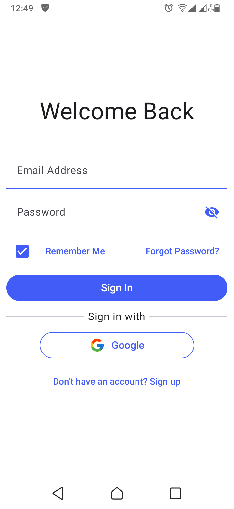
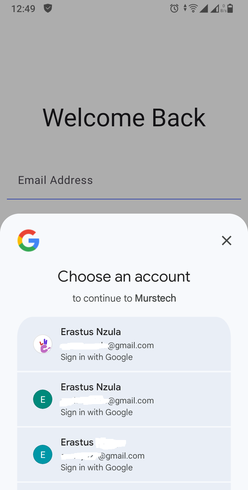
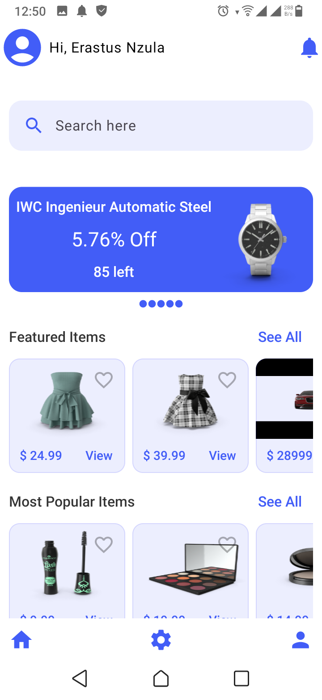
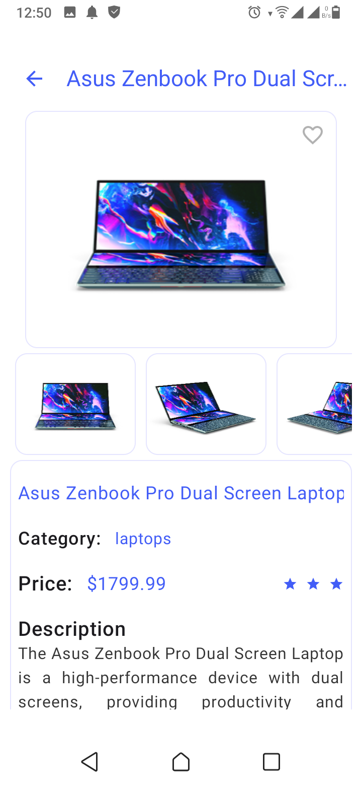
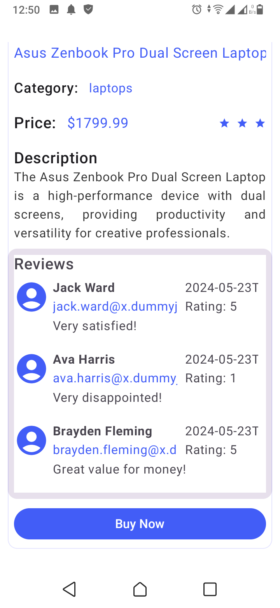

MURSTECH
========
This is an Android eCommerce application developed using Kotlin. The app provides features like product browsing, adding items to cart, user authentication with firebase and payment integration. It is designed to provide users with a seamless shopping experience on Android devices.

Features
--------
1. User Authentication: Sign up and login functionality with Firebase Authentication.

2. Product Listing: Display products with images, descriptions, and prices.

3. Search Functionality: Search products by category or name.

4. Shopping Cart: Add, remove, and modify items in the shopping cart.

5. Order Placement: View order summary and place an order.

6. Payment Integration: Integration with payment services like paypal and Stripe.

7. Notifications: Receive updates.

Screenshots
-----------

Login and Register 
------------------

    
    
    

Landing Page & Item View
----------

    
    
    

Technologies Used
------------------
1. Kotlin: Primary language for Android development.
2. Firebase: Authentication.
3. Retrofit: For API calls (if needed for external APIs).
4. Glide: For image loading.